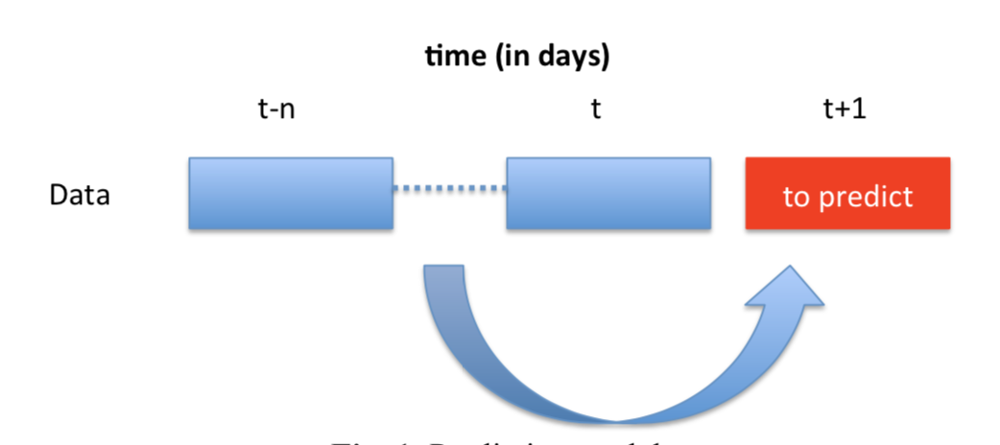
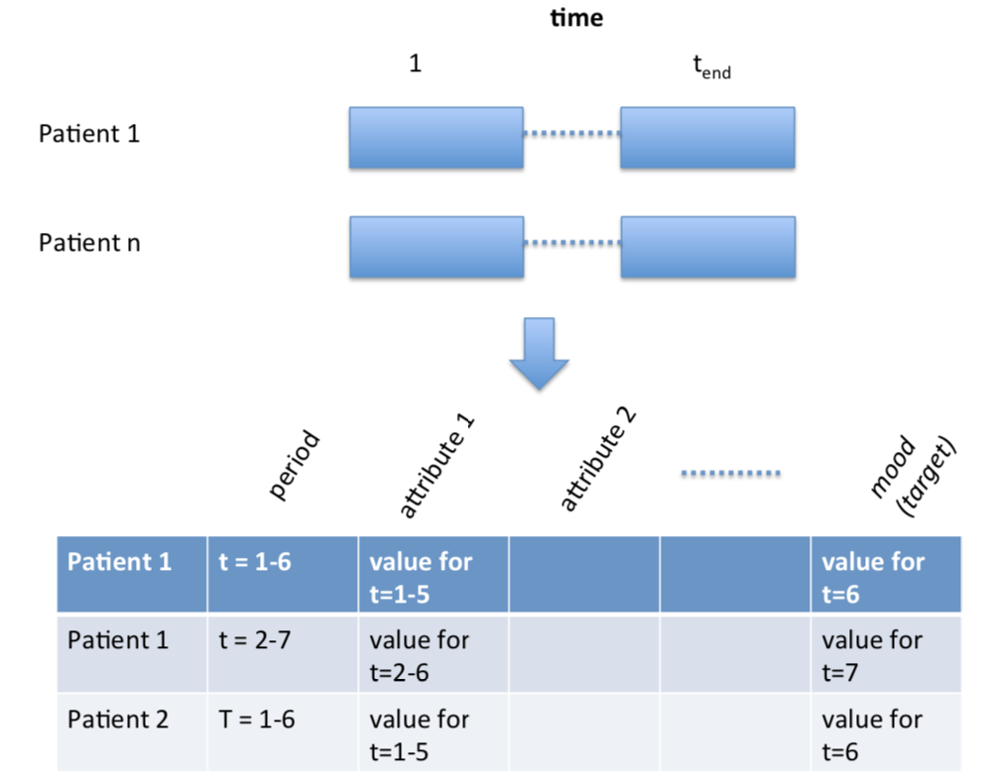
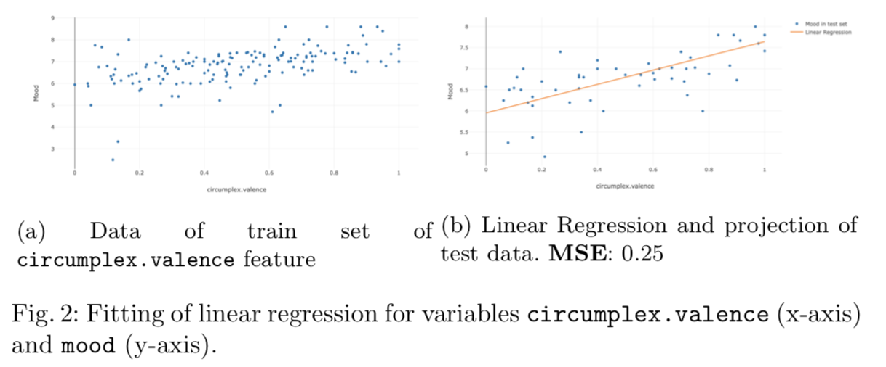
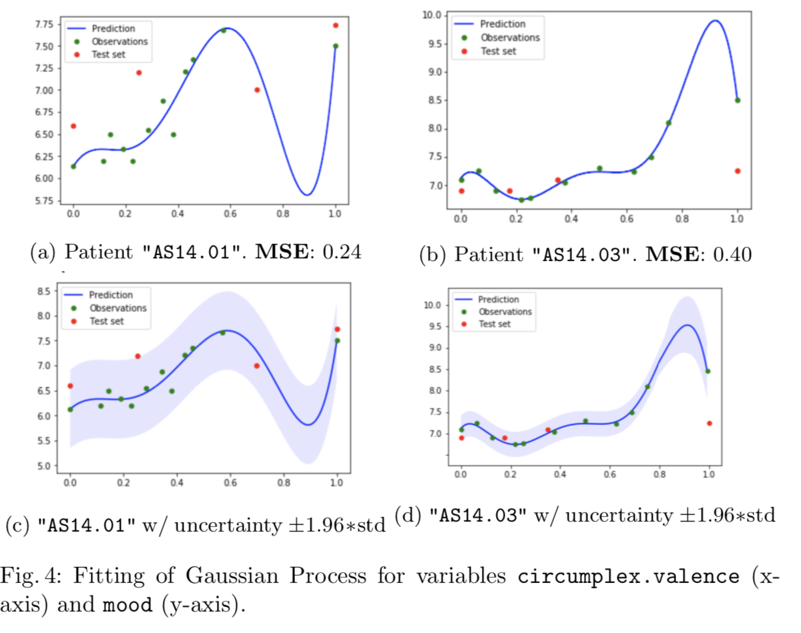
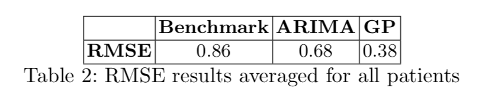
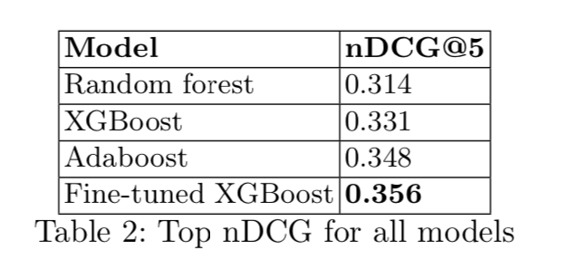

# DataMining
Data Mining Projects.

## [__Project 1 - Predicting mood using time-series analysis in mental health__](project_1/)
- [Assignment](project_1/Assignment1_advanced.pdf), [report](project_1/Report.pdf) and [code](project_1/lab_1.ipynb)

### Task

  
  

### Results

  

  

  

## [__Project 2 - Predicting the click behaviour of users in a hotel ranking system__](project_2/)
- [Assignment](project_2/Assignment2.pdf), [report](project_2/Report.pdf) and [code](project_2/lab_2.ipynb)

### Results

  

